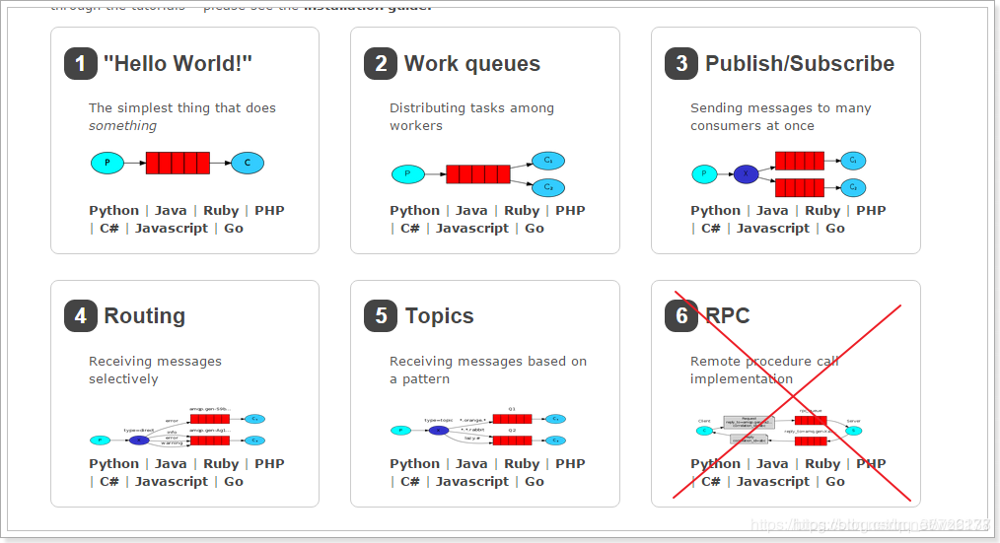

# 简介

rabbitmq 使用指南入门

## 模式

> 如下图：

1. 基本消息模型：生产者–>队列–>一个消费者
2. work消息模型：生产者–>队列–>多个消费者共同消费
3. 订阅模型-Fanout：广播，将消息交给所有绑定到交换机的队列，每个消费者都可以收到同一条消息
4. 订阅模型-Direct：定向，把消息交给符合指定 rotingKey 的队列（路由模式）
5. 订阅模型-Topic：通配符，把消息交给符合routing pattern（主题模式） 的队列（3、4、5这三种都属于订阅模型，只不过进行路由的方式不同。)

## 参考

- [RabbitMQ六种模式与SpringBoot整合](https://www.cnblogs.com/itplay/p/10647335.html)
