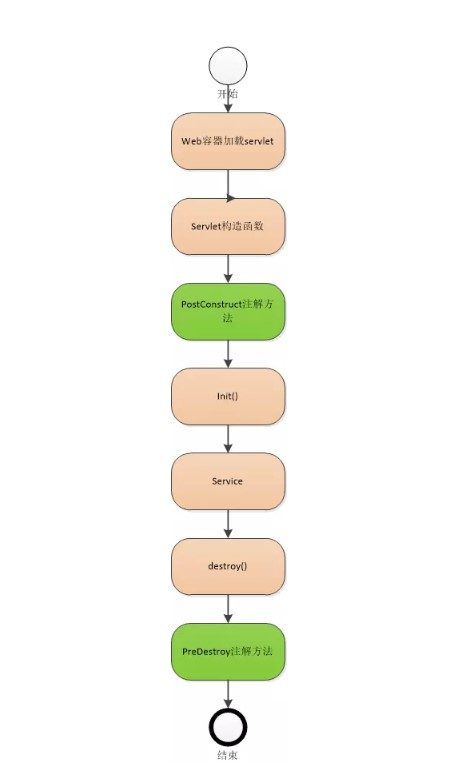

# 简介

某些场景下，我们的应用启动成功之后需要进行一些操作，比如：数据的预先加载、资源的初始化等。具体点如：删除临时文件、清除缓存、读取配置文件、数据库连接等等。
这些类似于 `开机启动服务` 的一些需求，我们就可以借助如下两个接口来实现：

- CommandLineRunner
- ApplicationRunner

## 二者联系与区别

从源码的描述来看，二者的区别不大（感兴趣可以自己去看下）、使用上也没什么区别。我们发现唯一的区别是接口定义的函数 `run` 中的参数不一样，
其中 `CommandLineRunner` 接收类似 `main` 函数的 `String... args` 参数、而 `ApplicationRunner` 则接收一个 `ApplicationArguments args`
参数。


## 使用

> 二者的使用都比较简单，这里就不花篇幅去描述了

* CommandLineRunner

```java
@Component
@Order(1)
@Slf4j
public class FirstCommandLineRunner implements CommandLineRunner {

    @Override
    public void run(String... args) throws Exception {
        log.info("==>  CommandLineRunner start " + this.getClass().getName() + " ...");
        // do something ...
    }
}
```

* ApplicationRunner

```java
@Component
@Slf4j
@Order(1)
public class FirstApplicationRunner implements ApplicationRunner {

    @Override
    public void run(ApplicationArguments args) throws Exception {
        log.info("==>  ApplicationRunner start " + this.getClass().getName() + " , args=[" + args + "] ...");
        // do something ...
    }

}
```

## 番外

> PostConstruct 的生命周期

