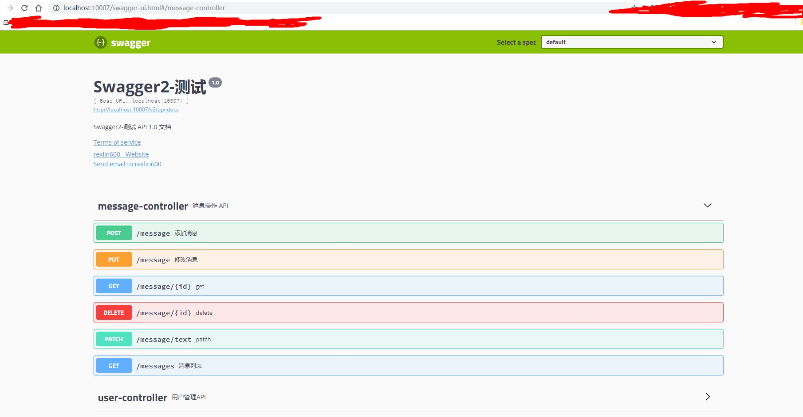

# 简介

`Swagger2`，相信大家都知道它的大名。它作为一款 `API` 聚合文档一直备受开发者的青睐。

## 开始发车

* 引入依赖

```xml
    <!-- lombok 用于简化实体类的构造器、getter/setter -->
    <dependency>
        <groupId>org.projectlombok</groupId>
        <artifactId>lombok</artifactId>
    </dependency>
    <!-- Swagger2 Start -->
    <dependency>
        <groupId>io.springfox</groupId>
        <artifactId>springfox-swagger2</artifactId>
        <version>2.9.2</version>
    </dependency>
    <dependency>
        <groupId>io.springfox</groupId>
        <artifactId>springfox-swagger-ui</artifactId>
        <version>2.9.2</version>
    </dependency>
    <!-- Swagger2 End -->
```

* 编写 Swagger2 配置

> @EnableSwagger2 注解用于启用 Swagger2 服务

```java
@Configuration
@EnableSwagger2
public class SwaggerConfig {

    @Bean
    public Docket api() {
        return new Docket(DocumentationType.SWAGGER_2)
                .apiInfo(apiInfo())
                .select()
                // 自行修改为自己的包路径
                .apis(RequestHandlerSelectors.basePackage("xyz.rexlin600"))
                .paths(PathSelectors.any())
                .build();
    }

    private ApiInfo apiInfo() {
        return new ApiInfoBuilder()
                .title("Swagger2-测试")
                .description("Swagger2-测试 API 1.0 文档")
                //服务条款网址
                .termsOfServiceUrl("http://www.rexlin600.com/")
                .version("1.0")
                .contact(new Contact("rexlin600", "http://www.rexlin600.com/", "rexlin600@gmail.com"))
                .build();
    }
}
```

* 按规则编写实体类、API接口

> 实体类

```java
@Data
@NoArgsConstructor
@AllArgsConstructor
public class Message implements Serializable {

    private Long id;

    @ApiModelProperty(value = "消息体")
    private String text;

    @ApiModelProperty(value = "消息总结")
    private String summary;

    private Date createDate;

    @Override
    public String toString() {
        return "Message{" +
                "id=" + id +
                ", text='" + text + '\'' +
                ", summary='" + summary + '\'' +
                ", createDate=" + createDate +
                '}';
    }
}
```

> 接口

```java
@Api(value = "消息", description = "消息操作 API", position = 100, protocols = "http")
@RestController
@RequestMapping("/")
public class MessageController {

    @Autowired
    private MessageRepository messageRepository;

    @ApiOperation(
            value = "消息列表",
            notes = "完整的消息内容列表",
            produces = "application/json, application/xml",
            consumes = "application/json, application/xml",
            response = List.class)
    @GetMapping(value = "messages")
    public List<Message> list() {
        List<Message> messages = this.messageRepository.findAll();
        return messages;
    }

    @ApiOperation(
            value = "添加消息",
            notes = "根据参数创建消息"
    )
    @ApiImplicitParams({
            @ApiImplicitParam(name = "id", value = "消息 ID", required = true, dataType = "Long", paramType = "query"),
            @ApiImplicitParam(name = "text", value = "正文", required = true, dataType = "String", paramType = "query"),
            @ApiImplicitParam(name = "summary", value = "摘要", required = false, dataType = "String", paramType = "query"),
    })
    @PostMapping(value = "message")
    public Message create(Message message) {
        System.out.println("message====" + message.toString());
        message = this.messageRepository.save(message);
        return message;
    }

    @ApiOperation(
            value = "修改消息",
            notes = "根据参数修改消息"
    )
    @PutMapping(value = "message")
    @ApiResponses({
            @ApiResponse(code = 100, message = "请求参数有误"),
            @ApiResponse(code = 101, message = "未授权"),
            @ApiResponse(code = 103, message = "禁止访问"),
            @ApiResponse(code = 104, message = "请求路径不存在"),
            @ApiResponse(code = 200, message = "服务器内部错误")
    })
    public Message modify(Message message) {
        Message messageResult = this.messageRepository.update(message);
        return messageResult;
    }

    @PatchMapping(value = "/message/text")
    public BaseResult<Message> patch(Message message) {
        Message messageResult = this.messageRepository.updateText(message);
        return BaseResult.successWithData(messageResult);
    }

    @GetMapping(value = "message/{id}")
    public Message get(@PathVariable Long id) {
        Message message = this.messageRepository.findMessage(id);
        return message;
    }

    @DeleteMapping(value = "message/{id}")
    public void delete(@PathVariable("id") Long id) {
        this.messageRepository.deleteMessage(id);
    }


}
```

* 访问接口文档

启动服务，访问： `http://localhost:10007/swagger-ui.html` 即可，如下：


